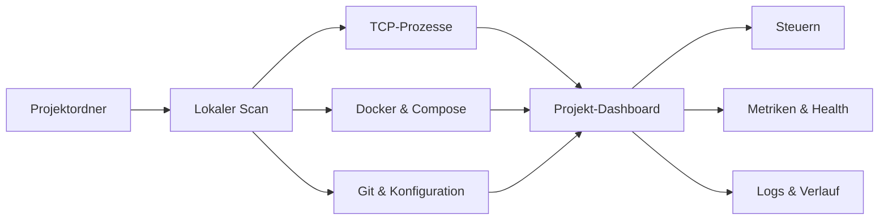

<p align="center">
  
</p>

<h1 align="center">Server Observer</h1>

<p align="center">
  <strong>Das lokale Developer Control Center für macOS.</strong><br>
  Projekte, Webserver, Prozesse und Docker-Container automatisch erkennen, verstehen und steuern.
</p>

<p align="center">
  <a href="https://github.com/shortcutchris/server-observer/releases/latest"><strong>Neueste Version laden</strong></a>
  ·
  <a href="#schnellstart">Schnellstart</a>
  ·
  <a href="#projektsteuerung-konfigurieren">Konfiguration</a>
  ·
  <a href="https://github.com/shortcutchris/server-observer/issues">Feedback</a>
</p>

<p align="center">
  <a href="https://github.com/shortcutchris/server-observer/releases/latest"></a>
  <a href="https://github.com/shortcutchris/server-observer/actions/workflows/ci.yml"></a>
  
  
  
</p>

---

## Schluss mit der Port-Suche

Wer parallel an mehreren Projekten arbeitet, kennt das Problem: Irgendwo läuft noch ein Dev-Server, ein anderer Prozess blockiert Port 3000 und zu welchem Repository der Container gehört, ist nicht mehr sofort erkennbar.

Server Observer ordnet lokale TCP-Prozesse und Docker-Container automatisch den passenden Projektordnern zu. Das frei skalierbare, widgetartige Panel zeigt auf einen Blick, **was läuft, wo es läuft und wie gesund es ist** — ohne Cloud-Dienst und ohne Projektcode zu übertragen.

> Server Observer lauscht nicht über das Mikrofon. Die App beobachtet ausschließlich lokale Prozess-, Port-, Git-, Datei- und Docker-Metadaten.

## Was du bekommst

| | Funktion | Nutzen |
|---|---|---|
| 🗂️ | **Automatische Projektzuordnung** | Git-, Compose-, Dev-Container- und Sprachprojekte werden erkannt und mit ihren Laufzeiten gruppiert. |
| 🟢 | **Server- und Containerübersicht** | Lokale Webserver, Datenbanken, Worker und Container ohne veröffentlichten Webport bleiben sichtbar. |
| ▶️ | **Start, Stop und Neustart** | Projekte, Profile, Prozesse und Docker-Container direkt aus Panel oder Menüleiste steuern. |
| 📊 | **Live-Metriken** | CPU, Arbeitsspeicher, Netzwerkvolumen, Prozessanzahl und Laufzeit im Blick behalten. |
| ❤️ | **Healthchecks** | Konfigurierte Services oder erkannte Webserver regelmäßig lokal prüfen. |
| ⚠️ | **Intelligente Portkonflikte** | Sehen, welcher fremde Prozess einen erwarteten Projektport bereits belegt. |
| 🌿 | **Git-Status** | Branch, Änderungen, Ahead/Behind und letzten Commit ohne Terminalwechsel sehen. |
| 📜 | **Logs und Verlauf** | Projektlogs lesen und Starts, Stops, Fehler sowie Health-Übergänge lokal nachvollziehen. |
| 🔔 | **Optionale Mitteilungen** | Bei Ausfällen, Erholung und neuen Portkonflikten benachrichtigt werden. |
| ⚡ | **Automationen** | Menüleiste, Apple Kurzbefehle, URL-Scheme und installierbare CLI verwenden. |

## So funktioniert es



- Projektordner und Scan-Tiefe sind frei konfigurierbar.
- Prozesse werden über ihr Arbeitsverzeichnis dem spezifischsten Projekt zugeordnet.
- Container werden über Compose-/Dev-Container-Labels und Bind-Mounts zugeordnet.
- Der Status wird regelmäßig aktualisiert; Änderungen an Prozessen erfolgen nur nach einer ausdrücklichen Aktion.

## Installation

1. Öffne das [neueste GitHub Release](https://github.com/shortcutchris/server-observer/releases/latest).
2. Lade `ServerObserver-<version>.zip` und entpacke es.
3. Verschiebe `ServerObserver.app` in den Ordner `/Applications`.
4. Starte die App und füge deine übergeordneten Projektordner hinzu.

Die öffentliche App ist eine notarisierte Universal-App für Apple Silicon und Intel und benötigt **macOS 14 oder neuer**. Neue Versionen werden anschließend über den kryptografisch signierten Sparkle-Feed angeboten.

## Schnellstart

Nach dem ersten Start:

1. Öffne über das Ordnersymbol die Einstellungen.
2. Füge einen oder mehrere Ordner hinzu, unter denen deine Repositories liegen.
3. Passe bei großen Verzeichnisbäumen die Scan-Tiefe an.
4. Wähle im Dashboard **Alle Projekte**, um auch gestoppte Projekte zu sehen.

Docker ist optional. Wenn die Docker CLI verfügbar und die Engine gestartet ist, erscheinen Container automatisch neben lokalen Prozessen.

## Projektsteuerung konfigurieren

Für Compose, Node.js, Swift, Go und Rust erkennt Server Observer gängige Startbefehle automatisch. Eigene Befehle, Profile, Ports und Services lassen sich im Projektstamm über `.server-observer.yml` festlegen:

```yaml
name: Acme Workspace
start: pnpm dev
stop: pnpm stop
restart: pnpm restart
logs: tail -n 250 logs/dev.log
health: http://localhost:3000/api/health
ports: [3000, 5432]
notifications: true

profiles:
  Frontend:
    start: pnpm dev:web
    stop: pnpm stop:web
  Full Stack:
    start: docker compose up -d
    stop: docker compose stop

services:
  Web App:
    url: http://localhost:3000
    health: http://localhost:3000/api/health
  Admin UI:
    url: http://localhost:8080
```

Eine kommentierte Vorlage liegt in [`.server-observer.example.yml`](.server-observer.example.yml). Externe Aktionen über URL, CLI oder Apple Kurzbefehle verlangen vor der Ausführung eine sichtbare Bestätigung in der App.

## CLI und Kurzbefehle

Die CLI lässt sich unter **Einstellungen → Steuerung** nach `~/.local/bin/server-observer` installieren:

```sh
server-observer open
server-observer refresh
server-observer start "Acme Workspace"
server-observer restart "Acme Workspace"
server-observer stop "Acme Workspace"
```

Die gleichen Projektaktionen stehen in Apple Kurzbefehle zur Verfügung. Außerdem unterstützt die App URLs wie `serverobserver://refresh`.

## Datenschutz und Sicherheit

Server Observer arbeitet lokal:

- kein Benutzerkonto und kein externer Backend-Dienst
- keine Übertragung von Projektcode, Logs oder Laufzeitdaten
- kein Mikrofon und keine Bildschirmaufzeichnung
- Healthchecks nur gegen erkannte oder ausdrücklich konfigurierte URLs
- sichere Prozessbeendigung zunächst per `SIGTERM`, optional per `SIGKILL`
- Bestätigung vor extern angeforderten Start-, Stop- und Neustartaktionen
- öffentliche Builds mit Apple Developer ID, Hardened Runtime und Notarisierung

Weitere Produkt- und Sicherheitsentscheidungen stehen in [SPEC.md](SPEC.md).

## Lokal entwickeln

Voraussetzungen sind macOS 14 oder neuer, Xcode und [XcodeGen](https://github.com/yonaskolb/XcodeGen).

```sh
git clone https://github.com/shortcutchris/server-observer.git
cd server-observer
xcodegen generate
open ServerObserver.xcodeproj
```

Tests lassen sich ohne lokale Codesignatur ausführen:

```sh
xcodebuild \
  -project ServerObserver.xcodeproj \
  -scheme ServerObserver \
  -configuration Debug \
  -derivedDataPath .build/DerivedData \
  CODE_SIGNING_ALLOWED=NO \
  test
```

Der signierte Veröffentlichungsprozess ist in [RELEASING.md](RELEASING.md) dokumentiert. Fehlerberichte und konkrete Verbesserungsvorschläge sind über [GitHub Issues](https://github.com/shortcutchris/server-observer/issues) willkommen.
